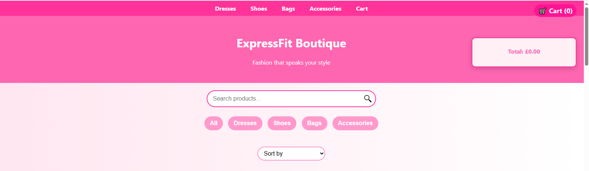
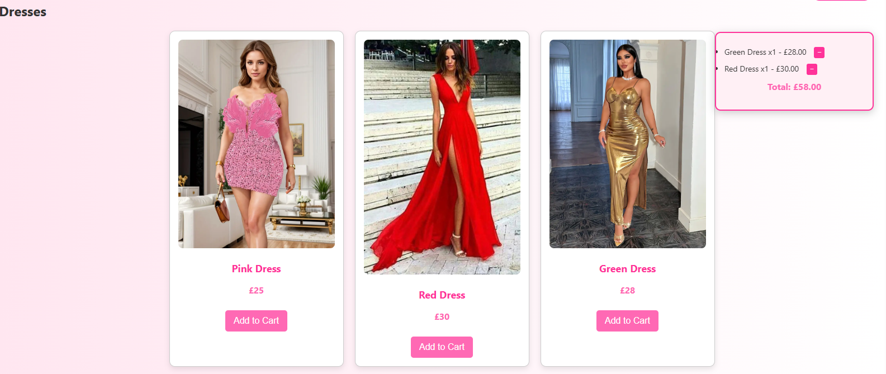
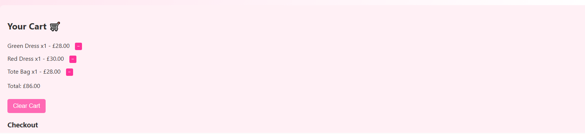
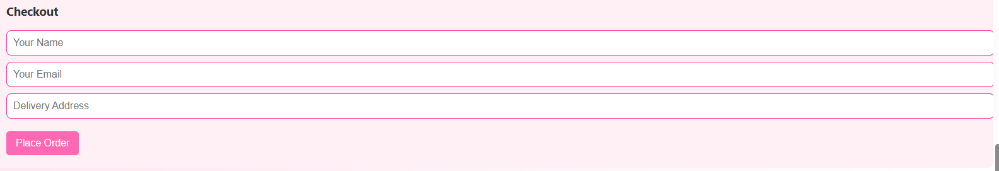
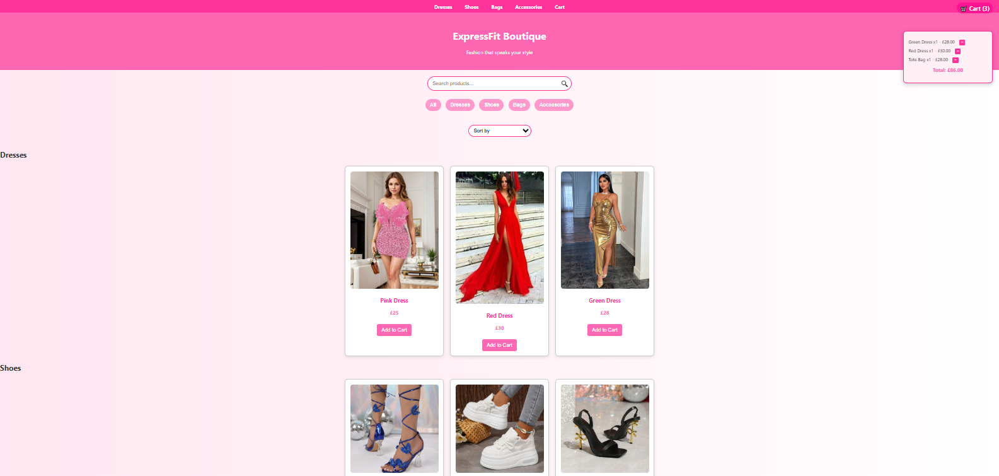

# ExpressFix Boutique

ExpressFix Boutique is a responsive fashion e-commerce prototype built with HTML, CSS, and JavaScript. It simulates a modern online shopping experience with dynamic product interaction, real-time cart management, and intuitive filtering.

## Features

- Live cart preview with quantity tracking
- Add/remove items with single-click controls
- Product search by name
- Category filtering (Dresses, Shoes, Bags, Accessories)
- Dropdown sorting by name and price
- Checkout simulation with confirmation alert
- Responsive layout for desktop and mobile

## Getting Started

To run the project locally:

1. Clone the repository:
   ```bash
   git clone https://github.com/your-username/ExpressFix-Boutique.git
Open index.html in your browser.

No build tools or server setup required—this is a pure frontend prototype.

 Screenshots
Homepage

Product Grid

Cart Preview

Checkout Form

Mobile View

 Technologies Used
HTML5

CSS3

JavaScript (Vanilla)

Git & GitHub for version control

  Folder Structure
Code
ExpressFix-Boutique/
├── index.html
├── css/
│   └── style.css
├── js/
│   └── script.js
├── screenshots/
│   ├── homepage.png
│   ├── product-grid.png
│   ├── cart-preview.png
│   ├── checkout-form.png
│   └── mobile-view.png
└── README.md
  Author
Emmanuela Frontend developer focused on clean UI, interactive features, and scalable design. Passionate about building systems that blend creativity with technical precision.

 Contact
GitHub:https://github.com/Cloud-Architect-Emma

LinkedIn:https://www.linkedin.com/in/cloud-architect-emma